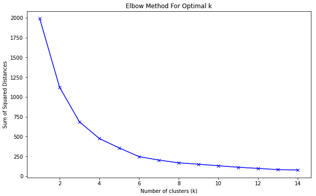

# YouTube Channels Clustering Analysis 🎥📊

This repository contains a comprehensive analysis of YouTube channels based on their "video views" and "uploads". We aim to group similar channels together using the k-means clustering algorithm.

## 🎯 Objective
Our main objective is to understand the pattern among YouTube channels based on their engagement (views) and content production (uploads) patterns.

## 🗃 Data Source
The dataset is named `Global YouTube Statistics.csv` and contains details about YouTube channels, including their views, uploads, subscribers, and more.

## 💼 Technologies Used
- Python
- Pandas
- Matplotlib
- Scikit-learn

## 📋 Workflow
1. **Data Preprocessing**: Extracted relevant columns and scaled the data.
2. **Elbow Test**: Determined the optimal number of clusters.
3. **K-means Clustering**: Applied clustering to the data.
4. **Visualization**: Visualized the clusters using scatter plots.

## 📉 Visualizations

*Elbow Method For Optimal K*

*Clusters of YouTube Channels based on Views and Uploads*

## 🔍 Conclusion
The analysis allowed us to categorize YouTube channels into 4 distinct groups based on their views and uploads. This can be helpful for advertisers, marketers, and content creators to understand the different content production and engagement patterns on YouTube.

---
